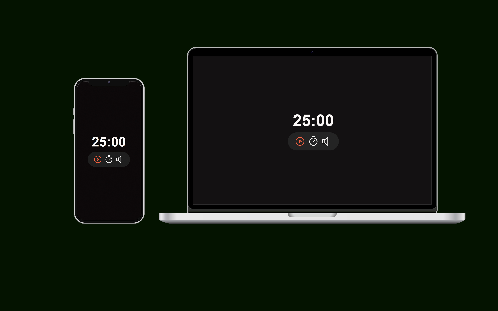

<h1 align="center">Focus Timer</h1>

  

  

## 💻 Projeto

Este projeto foi idealizado com o objetivo de aprimorar minha expertise em HTML, CSS e JavaScript, e usando componentes através do suporte e recursos fornecidos pela plataforma Rockeseat.

- [Acesse o projeto]()

## 🚀 Tecnologias

Esse projeto foi desenvolvido com as seguintes tecnologias:

- HTML e CSS
- JavaScript
- Git e Github
- Figma